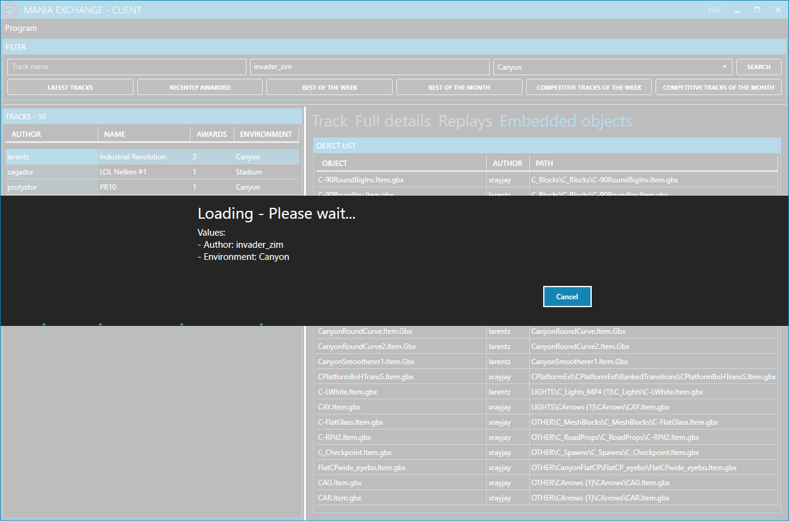

# Mania Exchange - Client

**TOC**
<!-- TOC -->

- [Mania Exchange - Client](#mania-exchange---client)
    - [General](#general)
    - [Using](#using)
        - [Replay window](#replay-window)
        - [Object window](#object-window)
        - [Thumbnail window](#thumbnail-window)
        - [Screenshot window](#screenshot-window)
    - [Settings](#settings)
    - [To-Dos](#to-dos)

<!-- /TOC -->

## General
This is a small program to gather informations from [Mania Exchange](https://tm.mania-exchange.com/) via their provides [API](https://api.mania-exchange.com/).

## Using

The usage of the program is very straight forward. You can search for tracks by using the following options:
- Track name
- Author
- Environment

> *Note*: If you leave the track name and the author blank the latest 10 tracks will be loaded

> *Note*: The search process needs some seconds. I've added a timeout to prevent endless searching.

On the left side you find a list with all tracks / maps of the author. When you select an entry the details will be shown on the right side.

On the right bottom you will find the following buttons:
- Show replays: Opens a new window with a list of the replays (only available if the track has replays)
- Show objects: Opens a new window with a list of the used objects (only available if the track has custom objects)
- Show online: Opens the track on Mania Exchange in your default browser
- Show thumbnail: Opens a window with the thumbnail (only available if the track has a thumbnail)
- Show screenshot: Opens a window with the screenshot (only available if the track has a screenshot)

### Replay window

### Object window

### Thumbnail window

### Screenshot window

## Settings
When you click on "Program > Settings" the settings window will be displayed. Here can you find the settings of the program.

Under *Appearance* you can change the theme and the accent color of the program.

Under *Endpoints* you will see the endpoints of the Mania Exchange API.

> **NOTE**: Edit the endpoints only when you know what you are doing! :)

## To-Dos
- Option to switch between short track infos (with image / thumbnail) and detailed informations
- Option to download a track