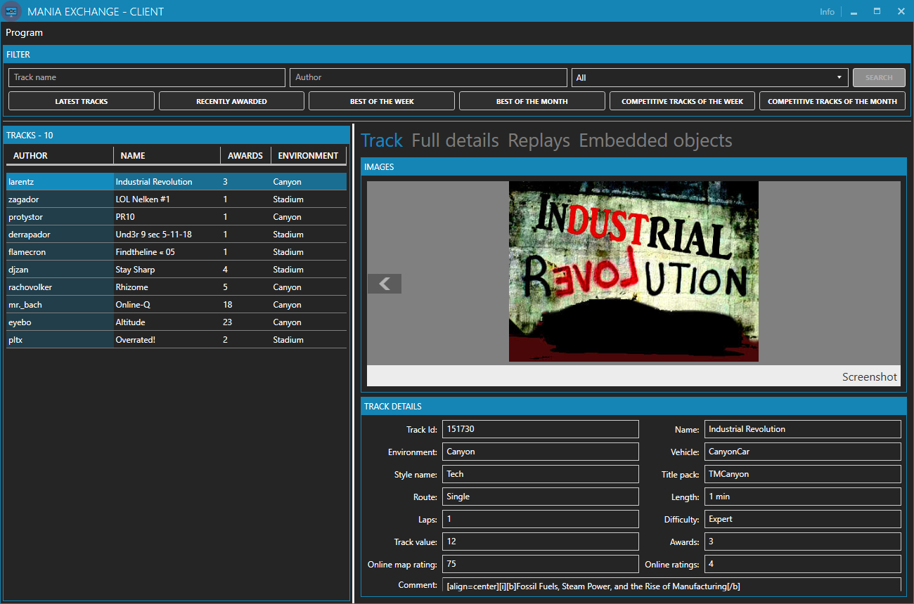
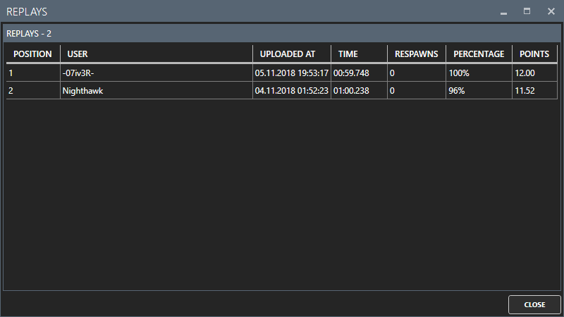
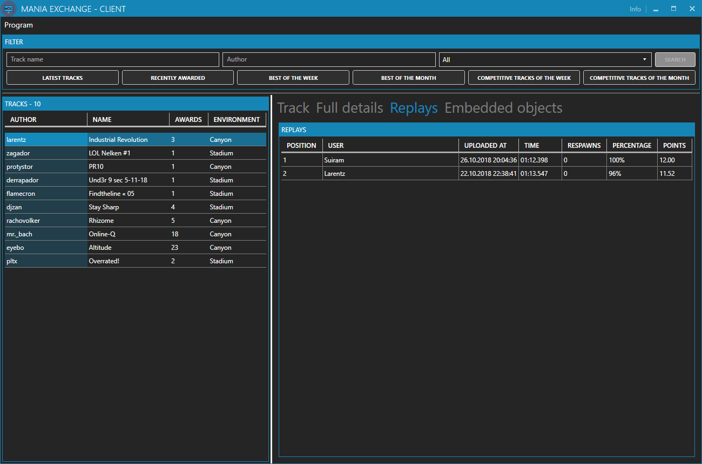
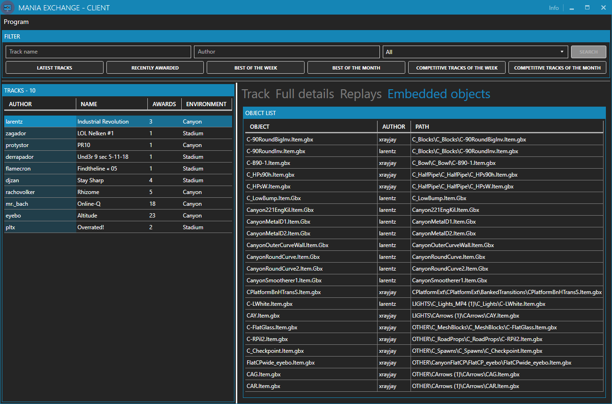
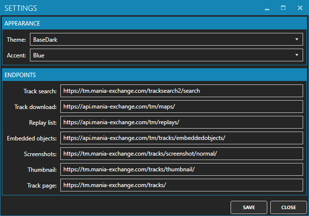
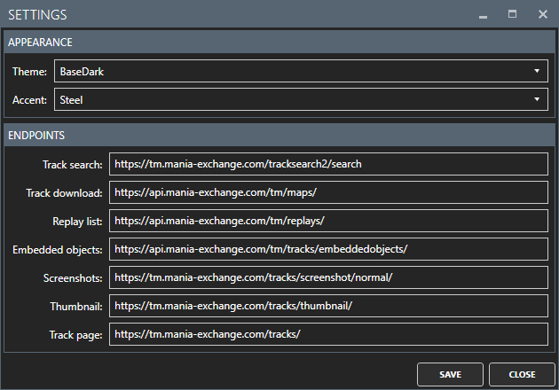

# Mania Exchange - Client

**TOC**
<!-- TOC -->

- [Mania Exchange - Client](#mania-exchange---client)
    - [General](#general)
    - [Using](#using)
        - [Replay window](#replay-window)
        - [Object window](#object-window)
        - [Thumbnail window](#thumbnail-window)
        - [Screenshot window](#screenshot-window)
    - [Settings](#settings)
    - [To-Dos](#to-dos)

<!-- /TOC -->

## General
This is a small program to gather informations from [Mania Exchange](https://tm.mania-exchange.com/) via their provides [API](https://api.mania-exchange.com/).

## Using

The usage of the program is very straight forward. You can search for tracks by using the following options:
- Track name
- Author
- Environment

Or you use one of the predefined filters:
- Latest tracks
- Recently awarded
- Best of the week
- Best of the month
- Competitive tracks of the week
- Competitive tracks of the month

> *Note*: If you use one of the predefined filters. Only 10 entries will be loaded and it seems that the filters not working as the filters on the website. So it can be that the results are different from the results of the website.

> *Note*: The search process needs some seconds. I've added a timeout to prevent endless searching.

### The left side
On the left side you can find a list of the tracks with some informations. If you select a track more informations will be shown on the right side.

### The right side
On the left side you can find further informations of the selected track. The informations are grouped in four different sections:
1. **Track**: Here you can find the basic informations like the name, the environment, the length, and so on. And you can see the thumbnail and screenshot of the track.
   

2. **Full details**: Here you can find more details about the selected track like the mood, the version of ManiaPlanet, and so on.
   

3. **Replays**: Here you can find the list of replays with the time and the name of the driver (only enabled when replays available).
   

4. **Embedded objects**: Here you can find a list of all objects which were used in the track (only enabled when embedded objects were used).
   

## Settings
When you click on "Program > Settings" the settings window will be displayed. Here can you find the settings of the program.

Under *Appearance* you can change the theme and the accent color of the program.

Under *Endpoints* you will see the endpoints of the Mania Exchange API.

> **NOTE**: Edit the endpoints only when you know what you are doing! :)

## Info
When you click on the button "Info" (top right of the window) you will find some short informations about the program.

## To-Dos
- Option to download a track