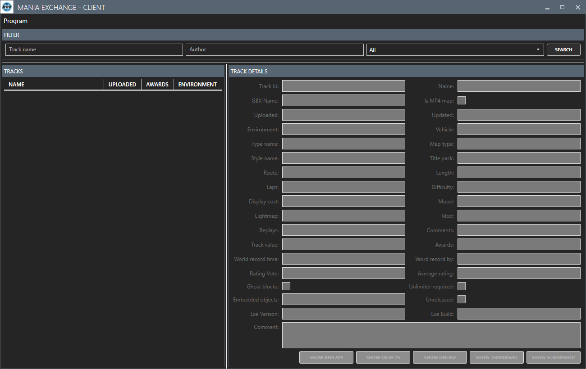
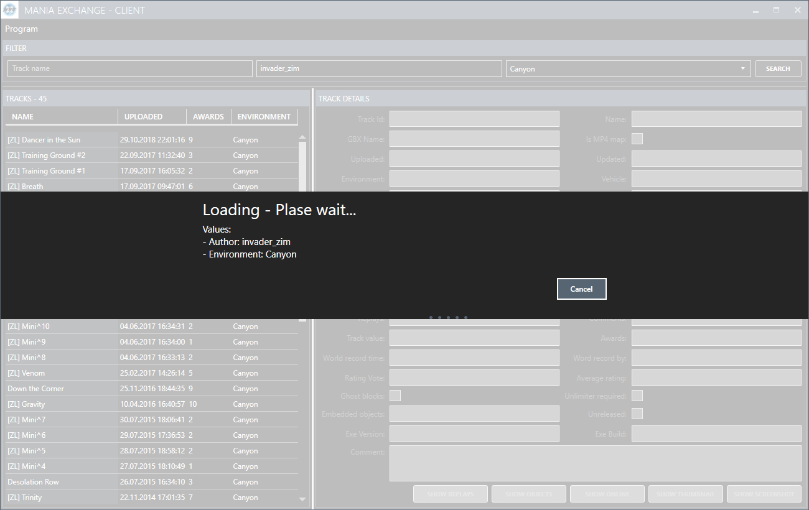

# Mania Exchange - Client

**TOC**
<!-- TOC -->

- [General](#general)
- [Using](#using)
- [Settings](#settings)
- [To-Dos](#to-dos)

<!-- /TOC -->

## General
This is a small program to gather informations from [Mania Exchange](https://tm.mania-exchange.com/) via their provides [API](https://api.mania-exchange.com/).

## Using
The usage of the program is very straight forward. Enter the name of you favorite author, wait a second and see the result.

On the left side you find a list with all tracks / maps of the author. When you select an entry the details will be shown on the right side.

If the track / map contains a screenshot / thumbnail you can show them when you click on "Show thumbnail" or "Show screenshot".

## Settings
When you click on "Program > Settings" the settings window will be displayed. Here can you find the settings of the program. 

## To-Dos
- ~~List of the latest tracks~~
- ~~More filter options~~
- Option to download a track
- List of the replays
- List of empbedded objects (if present)
- ~~Option to open the track on Mania Exchange~~